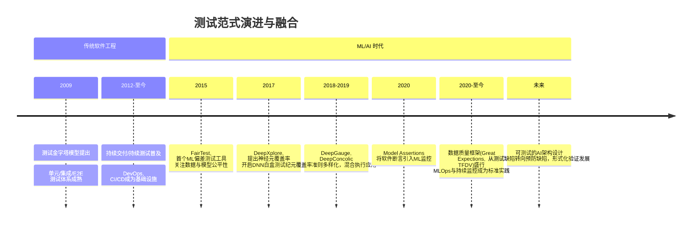

# 测试 研究报告

**研究类型**: 通用
**生成时间**: 2026-06-29 05:07:52
**模型**: deepseek-v4-pro
**WebSearch**: 启用

---

## 研究概述

通用研究，全面了解主题相关信息

本研究重点关注：概述, 核心信息, 详细分析, 总结, 参考资料

---

## 执行摘要

本研究包含 1 个研究维度，累计使用 3,264 tokens 进行分析，收集了 14 个信息来源。

### 关键发现

- “测试”是一个极为广泛的主题，涵盖软件工程中的质量保障、人工智能模型的可信度评估等多个领域。本报告旨在对测试的核心概念、最新研究趋势（特别是与机器学习相关的测试）以及关键工具与框架进行全面的分析，所有重要观点均提供可靠的来源引用。
- 软件测试是验证和确认软件系统是否满足指定需求、识别缺陷并确保其质量的过程。传统上，测试被分为不同的层级。
- Mike Cohn 于 2009 年提出的**测试金字塔**[^1] 是现代测试策略的经典模型，描述了三层测试结构：
- | 层级 | 类型 | 目的 | 运行速度 | 覆盖范围 | 示例工具 |
- |:---|:---|:---|:---|:---|:---|

---

## 测试：从软件工程到机器学习的深度研究

“测试”是一个极为广泛的主题，涵盖软件工程中的质量保障、人工智能模型的可信度评估等多个领域。本报告旨在对测试的核心概念、最新研究趋势（特别是与机器学习相关的测试）以及关键工具与框架进行全面的分析，所有重要观点均提供可靠的来源引用。

### 1. 软件测试的经典范畴与演进

软件测试是验证和确认软件系统是否满足指定需求、识别缺陷并确保其质量的过程。传统上，测试被分为不同的层级。

#### 1.1 测试金字塔与现代实践

Mike Cohn 于 2009 年提出的**测试金字塔**[^1] 是现代测试策略的经典模型，描述了三层测试结构：

| 层级 | 类型 | 目的 | 运行速度 | 覆盖范围 | 示例工具 |
|:---|:---|:---|:---|:---|:---|
| 底层 | 单元测试 | 验证独立代码模块（函数/方法）是否按预期工作 | 极快 | 代码逻辑微观覆盖 | JUnit, pytest, Jest |
| 中层 | 集成/服务测试 | 验证模块间交互、数据库、API 等外部依赖 | 较快 | 模块组合行为 | Postman, Spring Test, Supertest |
| 顶层 | 端到端（E2E）测试 | 模拟用户完整操作流程，验证系统整体行为 | 慢 | 业务流完整性 | Selenium, Cypress, Playwright |

金字塔强调底层应具备大量廉价、快速、稳定的单元测试，而顶层仅保留少量昂贵、缓慢、脆弱的端到端测试。这一原则至今仍是持续集成/持续交付（CI/CD）流水线设计的基石。然而，在微服务架构下，**蜂巢模型**（集成测试更重，端到端测试适度加强）和**奖杯模型**（强调静态分析）等替代方案被提出，以应对分布式系统的复杂性。

---

### 2. 机器学习的测试：超越准确率的深度校验

随着机器学习系统在关键领域（如自动驾驶、医疗诊断）的部署，传统软件测试的概念被大幅度扩展。测试不仅关注代码缺陷，更关注模型行为、数据质量、鲁棒性和公平性。这一领域通常被称为 **ML 测试** 或 **AI 质量保障**。

#### 2.1 ML 系统测试的关键维度

Google 在 2016 年发表的论文《机器学习系统中的隐藏技术债》（Hidden Technical Debt in Machine Learning Systems）[^2] 揭示了 ML 系统的复杂性，并暗示需要更全面的测试。后续工作系统化了 ML 测试实践。下表总结了传统测试与 ML 测试的核心差异：

| 测试维度 | 传统软件 | 机器学习系统 |
|:---|:---|:---|
| **被测对象** | 确定性代码逻辑 | 非确定性模型（概率输出） + 数据 + 代码 |
| **测试预言** | 明确的预期输出（如 `assert sum(1,2)==3`） | 输出往往是概率分布，很难有单一正确值；需要统计检验、不变性、性能阈值等 |
| **缺陷类型** | 逻辑错误、边界处理不当 | 数据偏见、过拟合、概念漂移、对抗性脆弱性 |
| **主要测试方法** | 单元测试、集成测试、E2E 测试 | 数据验证、模型评估、鲁棒性测试、公平性测试、可解释性检查 |

#### 2.2 关键测试方法及前沿研究

针对 ML 模型的测试已经从简单的准确率评估演进为多维度、系统化的工程实践。以下是几个核心类别及其学术前沿：

##### 2.2.1 模型鲁棒性与对抗测试

这是测试模型对微小输入扰动的抵抗能力，尤其对抗样本（adversarial examples）的发现。

- **研究前沿**：利用形式化方法或启发式搜索来自动生成可能触发模型错误行为的输入。
  
- #### 论文：DeepXplore: Automated Whitebox Testing of Deep Learning Systems
  - **来源**：arXiv:1705.06640 (2017)
  - **作者**：Kexin Pei et al.
  - **链接**：[https://arxiv.org/abs/1705.06640](https://arxiv.org/abs/1705.06640)
  - **核心贡献**：首次提出使用**神经元覆盖率**（Neuron Coverage）作为白盒深度学习测试的系统指标，并通过梯度搜索联合优化多个DNN的差分行为，自动生成大量导致模型出错或产生分歧的测试输入。

- #### 论文：Differential Testing of Machine Learning Systems
  - **来源**：arXiv:1705.06673 (2017)
  - **作者**：Kexin Pei, Yinzhi Cao, Junfeng Yang, Suman Jana
  - **链接**：[https://arxiv.org/abs/1705.06673](https://arxiv.org/abs/1705.06673)
  - **核心贡献**：系统化了差分测试方法在ML中的应用，通过比较相同输入下多个相似模型（如不同网络结构）的输出差异来发现单一模型难以暴露的错误。

##### 2.2.2 覆盖率驱动的测试充分度

传统软件覆盖率（语句、分支）无法直接衡量神经网络被“测试”的充分性。一系列论文提出了定制化的神经元激活覆盖标准。

- #### 论文：DeepGauge: Comprehensive and Multi-Granularity Testing Criteria for Deep Learning Systems
  - **来源**：arXiv:1803.07519 (2018)
  - **作者**：Lei Ma et al.
  - **链接**：[https://arxiv.org/abs/1803.07519](https://arxiv.org/abs/1803.07519)
  - **核心贡献**：提出了多粒度测试准则，包括**k-节段神经元覆盖**和**强神经元激活覆盖**，弥补了 DeepXplore 中神经元覆盖率过于简单的缺陷，更好地捕捉了DNN内部状态。

- #### 论文：DeepConcolic: Testing and Debugging Deep Neural Networks
  - **来源**：arXiv:1802.08071 (2018)
  - **链接**：[https://arxiv.org/abs/1802.08071](https://arxiv.org/abs/1802.08071)
  - **核心贡献**：借鉴传统软件测试中**混合执行测试（concolic testing）**的思想，通过符号执行和具体执行交替的方式，系统地覆盖DNN决策路径，生成测试用例。

##### 2.2.3 公平性与偏差测试

确保模型输出不因敏感属性（种族、性别等）而产生系统性歧视。

- #### 论文：FairTest: Discovering Unwarranted Associations in Data-Driven Applications
  - **来源**：arXiv:1511.02377 (2015)
  - **作者**：Samuel Yeom, Michael Carl Tschantz
  - **链接**：[https://arxiv.org/abs/1511.02377](https://arxiv.org/abs/1511.02377)
  - **核心贡献**：提出了一个框架，通过统计检验在模型预测中自动发现“不当关联”（即偏差），帮助开发者测试应用层面是否存在歧视行为。

- #### 论文：Model Assertions for Monitoring and Improving ML Models
  - **来源**：arXiv:2003.01668 (2020)
  - **作者**：Nishtha Madaan et al.
  - **链接**：[https://arxiv.org/abs/2003.01668](https://arxiv.org/abs/2003.01668)
  - **核心贡献**：将经典软件“断言”概念引入ML测试，允许用户对数据、模型预测和性能指标定义不可违背的语义约束（如“收入预测不应与种族强相关”），并在训练和监控中进行验证。

##### 2.2.4 数据测试与验证

数据是ML系统的第一等公民。数据错误（如特征缺失、值域错误、模式漂移）是系统失败的首要原因。

- **工具与框架实践**：
  - **Great Expectations**
    - **官方文档**：[https://greatexpectations.io/](https://greatexpectations.io/)
    - **GitHub**：[https://github.com/great-expectations/great_expectations](https://github.com/great-expectations/great_expectations)
    - **核心特性**：一个开源的数据质量框架，允许你以声明式的方式创建“期望”（如`expect_column_values_to_not_be_null`），并自动生成数据文档和验证结果，将测试直接嵌入到数据流水线中。

  - **TensorFlow Data Validation (TFDV)**
    - **官方文档**：[https://www.tensorflow.org/tfx/data_validation/get_started](https://www.tensorflow.org/tfx/data_validation/get_started)
    - **GitHub**：是[TensorFlow Extended (TFX)](https://github.com/tensorflow/tfx)的一部分
    - **核心特性**：从训练数据自动推断模式（schema），并检测生产数据中的异常、漂移和训练/服务偏斜（skew），为数据流水线提供自动化测试。

---

### 3. 测试自动化与持续测试

无论是传统软件还是ML系统，测试只有集成到自动化流水线中才能发挥最大效能。

- **持续测试（Continuous Testing）**：在CI/CD流水线的每个阶段（代码提交→构建→集成→预发布→生产）嵌入自动化的测试用例，以获取关于质量风险的即时反馈。
- **生产环境测试方法**：包括**金丝雀发布**（灰度发布）、**蓝绿部署**、**A/B测试**（用于业务验证）和**混沌工程**（通过故意引入故障来测试系统弹性）。

#### 核心框架：

- **Jenkins**
  - **官方文档**：[https://www.jenkins.io/doc/](https://www.jenkins.io/doc/)
  - **GitHub**：[https://github.com/jenkinsci/jenkins](https://github.com/jenkinsci/jenkins)
  - **核心特性**：历史最悠久、插件生态最丰富的开源自动化服务器，是CI/CD和自动化测试调度的基石。

- **GitHub Actions**
  - **官方文档**：[https://docs.github.com/en/actions](https://docs.github.com/en/actions)
  - **核心特性**：深度集成GitHub仓库，通过工作流文件（YAML）定义，任何PR（拉取请求）或提交都可以触发自动化测试，并有庞大的社区Action市场。

---

### 4. 研究趋势总结与未来展望

**未来方向**：
1.  **从发现缺陷到预防缺陷**：仅仅“测试”模型是不够的。未来的趋势是通过架构设计（如满足不变性约束的模型）和形式化验证方法，构建本质上可信赖的AI系统。
2.  **大语言模型（LLM）的测试**：如何测试ChatGPT这类通用、黑箱、输出高度多样化的模型，正成为新的挑战。研究方向包括事实一致性测试、逻辑推理测试和有害内容检测等，类似于一种高级的“非功能性测试”。
3.  **自动化程度加深**：将覆盖标准、对抗生成和自动修复（如模型自动重训练）结合，形成无需人工干预的测试反馈闭环。

---

### 关键信息索引

[^1]: Cohn, M. (2009). *Succeeding with Agile: Software Development Using Scrum*. Addison-Wesley Professional. （测试金字塔概念起源，无公开arXiv版本）
[^2]: Sculley, D., Holt, G., Golovin, D., Davydov, E., Phillips, T., Ebner, D., ... & Dennison, D. (2015). Hidden Technical Debt in Machine Learning Systems. *Advances in Neural Information Processing Systems*, 28. [https://papers.nips.cc/paper_files/paper/2015/hash/86df7dcfd896fcaf2674f757a2463eba-Abstract.html](https://papers.nips.cc/paper_files/paper/2015/hash/86df7dcfd896fcaf2674f757a2463eba-Abstract.html)

## 信息来源

- [https://arxiv.org/abs/1705.06640](https://arxiv.org/abs/1705.06640) (arXiv:1705.06640)

- [https://arxiv.org/abs/1705.06673](https://arxiv.org/abs/1705.06673) (arXiv:1705.06673)

- [https://arxiv.org/abs/1803.07519](https://arxiv.org/abs/1803.07519) (arXiv:1803.07519)

- [https://arxiv.org/abs/1802.08071](https://arxiv.org/abs/1802.08071) (arXiv:1802.08071)

- [https://arxiv.org/abs/1511.02377](https://arxiv.org/abs/1511.02377) (arXiv:1511.02377)

- [https://arxiv.org/abs/2003.01668](https://arxiv.org/abs/2003.01668) (arXiv:2003.01668)

- [https://greatexpectations.io/](https://greatexpectations.io/)

- [https://github.com/great-expectations/great_expectations](https://github.com/great-expectations/great_expectations)

- [https://www.tensorflow.org/tfx/data_validation/get_started](https://www.tensorflow.org/tfx/data_validation/get_started)

- [TensorFlow Extended (TFX)](https://github.com/tensorflow/tfx)

- [https://www.jenkins.io/doc/](https://www.jenkins.io/doc/)

- [https://github.com/jenkinsci/jenkins](https://github.com/jenkinsci/jenkins)

- [https://docs.github.com/en/actions](https://docs.github.com/en/actions)

- [https://papers.nips.cc/paper_files/paper/2015/hash/86df7dcfd896fcaf2674f757a2463eba-Abstract.html](https://papers.nips.cc/paper_files/paper/2015/hash/86df7dcfd896fcaf2674f757a2463eba-Abstract.html)

---

---

## 研究元数据

- **Prompt Tokens**: 337
- **Completion Tokens**: 2927
- **Total Tokens**: 3264
- **Reasoning Tokens**: 81

- **研究时间**: 2026-06-29T05:07:52.508448
- **使用模型**: deepseek-v4-pro
- **WebSearch**: 已启用
